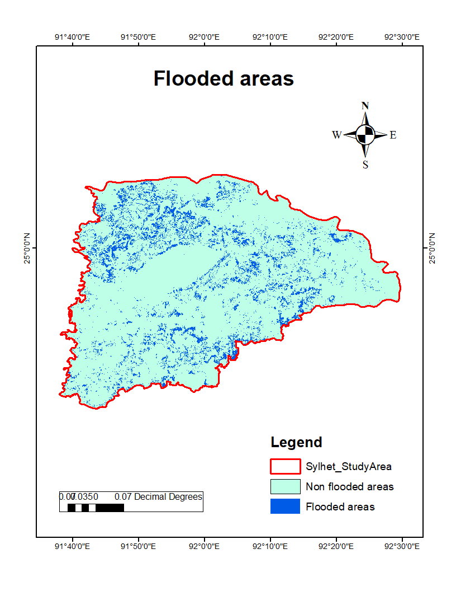
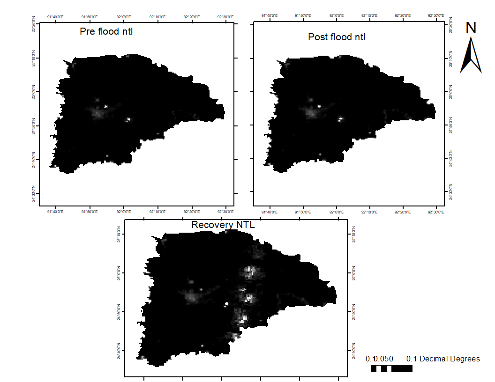

### Code link of Assessment of Post-Flood Recovery in Sylhet district of Bangladesh Using VIIRS Nighttime Lights and Socio-Economic Data

- Code link [this is the link of the post flood recovery of Sylhet district](https://code.earthengine.google.com/9236463d55d481023ac0084abb442b5e)

### Map of flooded areas in Sylhet in 2017

### Night time light data comaparison map

